# Build a Multi-Agent System for GitHub Repository Analysis

As a developer, you've likely spent countless hours trying to make sense of unfamiliar codebases — whether for code reviews, evaluating open-source libraries, or onboarding onto a new team project. What if you could automate that entire process and get deep insights in minutes instead of hours?

In this guide, you'll build a multi-agent system that does exactly that: automatically analyzes any GitHub repository and provides a structured breakdown of its architecture, dependencies, code quality, and even external research context. Think of it as assembling a team of expert developers who instantly scan, understand, and report on a codebase — all powered by Coral Protocol.

## What is Coral Protocol?

AI agents are advancing rapidly — writing code, answering questions, managing tasks, and even interacting with APIs. But despite these capabilities, most agents remain isolated, operating within the boundaries of a single tool or orchestration script. What’s missing is infrastructure: a way for agents to connect, coordinate, and collaborate like distributed teams.

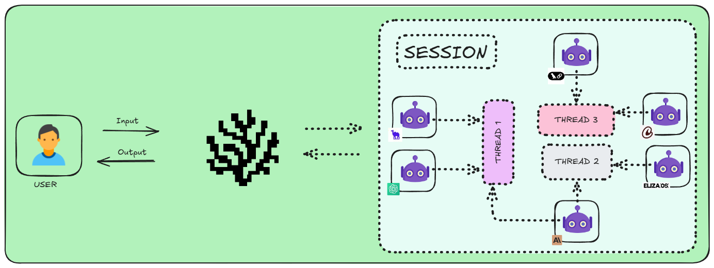

Coral Protocol was created to solve this gap. Coral Protocol introduces Sessions: shared environments where agents communicate through threads, coordinate tasks, and transact securely. Developers no longer need to figure out agent-to-agent communication. Coral handles that, so they can focus on making agents smarter, more capable, and better at solving specific problems.

## What You'll Build

Using this Open Decentralized Infrastructure, you'll create a Multi-Agent-System:
- An Interface Agent receives your requests and coordinates the workflow
- A Repository Understanding Agent analyzes the codebase structure and functionality  
- An OpenDeepResearch Agent performs detailed research and generates reports

We'll use agents from the [Awesome Agents for Multi-Agent Systems repo](https://github.com/Coral-Protocol/awesome-agents-for-multi-agent-systems).

All agents communicate through Coral Protocol's session-based infrastructure, and you'll monitor everything through a web-based debugger.

## Prerequisites

Before starting, ensure you have the required software and API keys.

### Software Requirements

| Tool | Version | Purpose |
|------|---------|---------|
| Node.js | 18+ | JavaScript runtime for the debugger UI |
| Python | 3.10+ | Runtime for the AI agents |
| Java JDK | 24 | Required for the Coral backend server |
| Postman | Latest | API testing and interaction |

### API Keys Needed

You'll need these API keys before proceeding:

| Service | Where to Get It | Usage |
|---------|----------------|-------|
| OpenAI | [platform.openai.com](https://platform.openai.com/account/api-keys) | Powers all AI agents |
| LinkUp | [app.linkup.so](https://app.linkup.so/home) | Used by research agent for data analysis |
| GitHub Token | [github.com/settings/tokens](https://github.com/settings/tokens) | Repository access permissions |

Keep these keys handy - you'll need them during setup.

## Step 1: Set Up Your Project Structure

Before we start building our multi-agent system, we need to gather all the necessary components. Think of this as collecting all the building blocks we'll need to construct our system. Each repository contains a specific agent with unique capabilities that will work together.

### Why these repositories?
- **Coral-Interface-Agent**: This is our command center. It will receive your instructions and coordinate the other agents, similar to how a project manager coordinates a team.
- **Coral-RepoUnderstanding-Agent**: This agent is like a code reviewer who can quickly scan and understand repository structures. It will help us analyze GitHub projects efficiently.
- **Coral-OpenDeepResearch-Agent**: This is our research specialist that can dive deep into topics and generate comprehensive reports.
- **coral-server**: This is the backbone of our system, handling communication between agents and managing sessions.
- **coral-dbg**: This is our control panel that will help us visualize and monitor agent interactions.

First, create a workspace and clone all necessary repositories:

```bash
mkdir coral-project
cd coral-project

# Clone the three agents
git clone https://github.com/Coral-Protocol/Coral-Interface-Agent.git
git clone https://github.com/Coral-Protocol/Coral-RepoUnderstanding-Agent.git
git clone https://github.com/Coral-Protocol/Coral-OpenDeepResearch-Agent.git

# Clone server and debugger
git clone https://github.com/Coral-Protocol/coral-server.git
git clone https://github.com/Coral-Protocol/coral-dbg.git
```

Open the project in your code editor:

```bash
code .
```

Your folder structure should look like this:
```
coral-project/
├── Coral-Interface-Agent/
├── Coral-OpenDeepResearch-Agent/
├── Coral-RepoUnderstanding-Agent/
├── coral-server/
└── coral-dbg/
```

**Expected Output:**
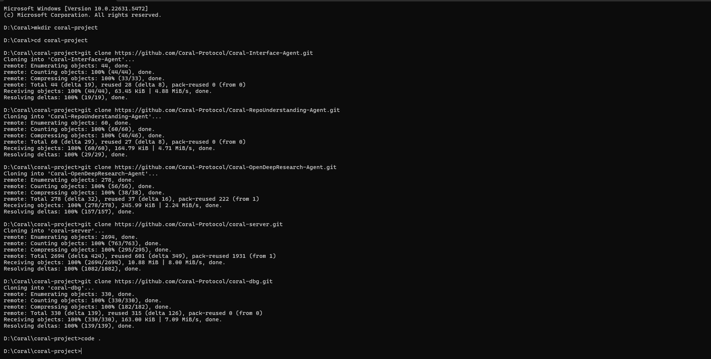

## Step 2: Configure the Coral Server

Now that we have all our components, we need to set up the communication infrastructure. The Coral server acts as the communication hub for your agents. You need to configure it to recognize and run your agents.

Navigate to the `coral-server` directory:

```bash
cd coral-server
```

Open `src/main/resources/application.yaml` and replace its contents with this configuration:

This `application.yaml` acts as a blueprint that tells the server which agents are available, how to run each agent, what API keys they need, and how they should connect to each other:

```yaml
registry:
  coral-interface:
    options:
      - name: "OPENAI_API_KEY"
        type: "string"
        description: "OpenAI API Key for Interface Agent"
    runtime:
      type: "executable"
      command:
        [
          "bash",
          "-c",
          "cd ../Coral-Interface-Agent && uv sync && uv run python 0-langchain-interface.py",
        ]
      environment:
        - name: "OPENAI_API_KEY"
          from: "OPENAI_API_KEY"

  coral-repo:
    options:
      - name: "OPENAI_API_KEY"
        type: "string"
        description: "OpenAI API Key for Repository Agent"
      - name: "GITHUB_PERSONAL_ACCESS_TOKEN"
        type: "string"
        description: "GitHub Personal Access Token"
    runtime:
      type: "executable"
      command:
        [
          "bash",
          "-c",
          "cd ../Coral-RepoUnderstanding-Agent && uv sync && uv run 4-langchain-RepoUnderstandingAgent.py",
        ]
      environment:
        - name: "OPENAI_API_KEY"
          from: "OPENAI_API_KEY"
        - name: "GITHUB_PERSONAL_ACCESS_TOKEN"
          from: "GITHUB_PERSONAL_ACCESS_TOKEN"

  coral-research:
    options:
      - name: "OPENAI_API_KEY"
        type: "string"
        description: "OpenAI API Key for Research Agent"
      - name: "LINKUP_API_KEY"
        type: "string"
        description: "LinkUp API Key for Research Agent"
    runtime:
      type: "executable"
      command:
        [
          "bash",
          "-c",
          "cd ../Coral-OpenDeepResearch-Agent && uv sync && uv run python langchain_open_deep_research.py",
        ]
      environment:
        - name: "OPENAI_API_KEY"
          from: "OPENAI_API_KEY"
        - name: "LINKUP_API_KEY"
          from: "LINKUP_API_KEY"
```

## Step 3: Start the Coral Server

Now start the server that will coordinate your agents:

```bash
./gradlew run
```

> Keep this terminal open - the server needs to stay running. You should see output indicating the server has started successfully on port 5555.

**Expected Output:**
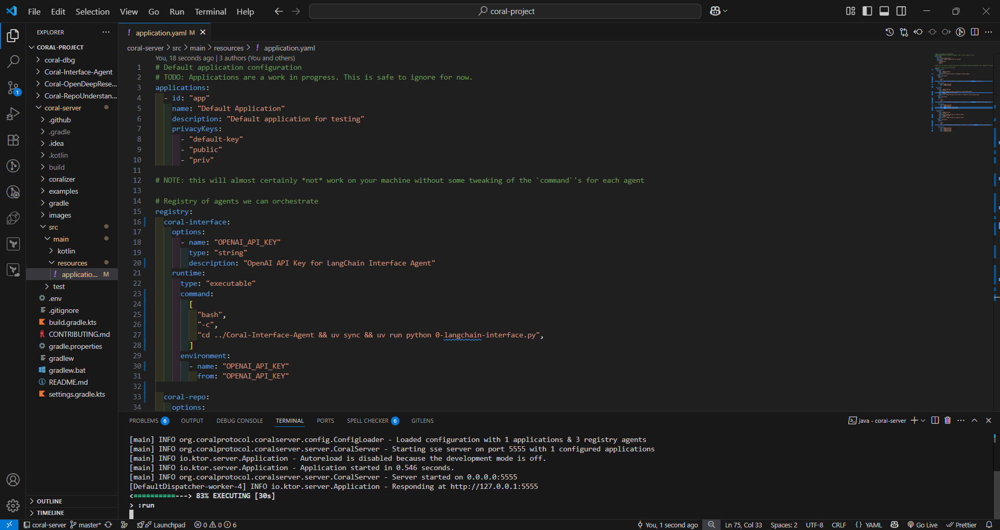

## Step 4: Create a Session

Sessions are isolated workspaces where your agents collaborate. Think of a session as a private environment where your agents can communicate securely.

Open Postman and create a new request:

**Method:** POST  

**URL:** `http://localhost:5555/sessions`

**Request Body (JSON):**
```json
{
  "sessionId": "github-analysis-session",
  "applicationId": "github-analyzer",
  "privacyKey": "secure-key-123",
  "agentGraph": {
    "agents": {
      "my-interface": {
        "type": "local",
        "agentType": "coral-interface",
        "options": {
          "OPENAI_API_KEY": "YOUR_OPENAI_API_KEY"
        }
      },
      "my-repo": {
        "type": "local",
        "agentType": "coral-repo",
        "options": {
          "OPENAI_API_KEY": "YOUR_OPENAI_API_KEY",
          "GITHUB_PERSONAL_ACCESS_TOKEN": "YOUR_GITHUB_TOKEN"
        }
      },
      "my-research": {
        "type": "local",
        "agentType": "coral-research",
        "options": {
          "OPENAI_API_KEY": "YOUR_OPENAI_API_KEY",
          "LINKUP_API_KEY": "YOUR_LINKUP_API_KEY"
        }
      }
    },
    "links": [["my-interface", "my-repo", "my-research"]]
  }
}
```

**Important:** Replace all `YOUR_*_API_KEY` placeholders with your actual API keys.

Send the request. The response will contain your session details. Save these values - you'll need them:
- `sessionId`
- `applicationId` 
- `privacyKey`

**Expected Output:**

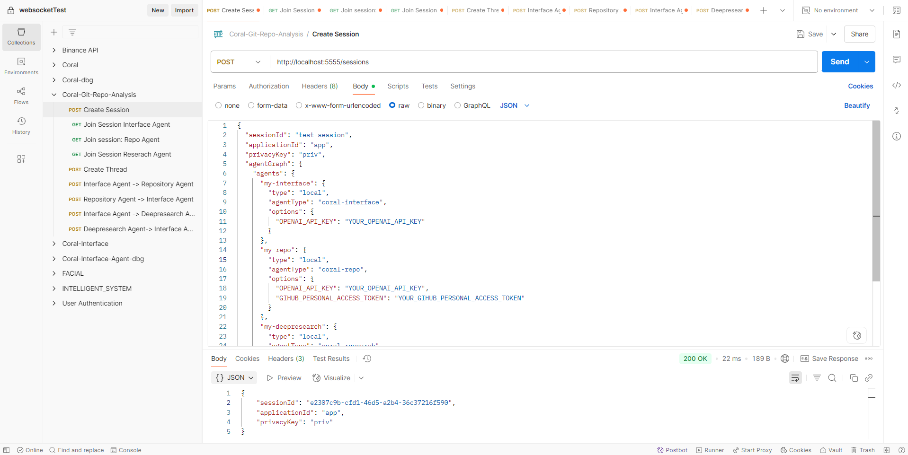

## Step 5: Connect Your Agents

Once your session is created, it's time to connect each agent so they can start listening for messages. Each agent opens a **Server-Sent Events (SSE)** connection to the Coral Server. This lets you see live messages and interactions.

Create three new GET requests in Postman (open each in a separate tab):

**Agent 1 - Interface Agent:**
```
GET http://127.0.0.1:5555/devmode/github-analyzer/secure-key-123/github-analysis-session/sse?agentId=my-interface
```

**Agent 2 - Repository Agent:**
```
GET http://127.0.0.1:5555/devmode/github-analyzer/secure-key-123/github-analysis-session/sse?agentId=my-repo
```

**Agent 3 - Research Agent:**
```
GET http://127.0.0.1:5555/devmode/github-analyzer/secure-key-123/github-analysis-session/sse?agentId=my-research
```

Send all three requests. Each should show "Connected" status and start streaming events. Keep these tabs open to monitor agent activity.

**Expected Output:**

Interface Agent Connection:

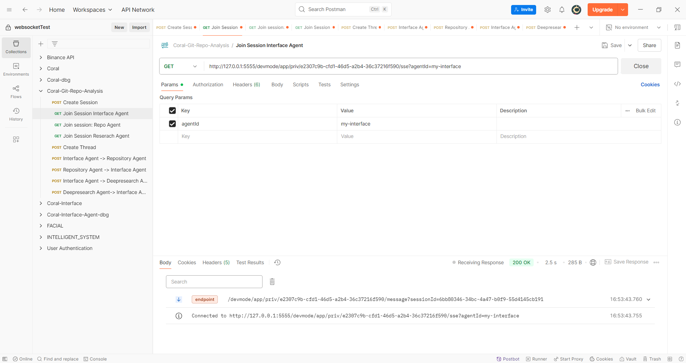

Repository Agent Connection:

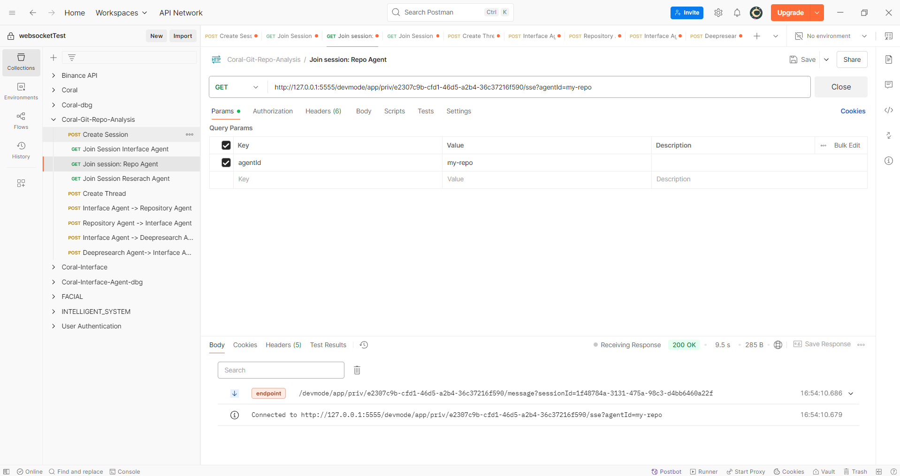

Research Agent Connection:

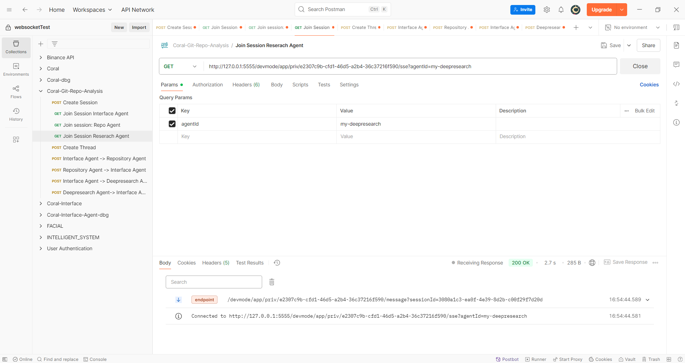

## Step 6: Create a Communication Thread

When you establish a connection between your Agents and the Coral server, the next step is to create threads. Threads organize specific conversations within a session.

Let's create our first thread:

**Method:** POST  

**URL:** `http://127.0.0.1:5555/debug/github-analyzer/secure-key-123/github-analysis-session/my-interface/thread/`

**Request Body:**
```json
{
  "threadName": "GitHub Repository Analysis",
  "participantIds": ["my-interface", "my-repo", "my-research"]
}
```

The response will include a `threadId`. Save this value.

**Expected Output:**

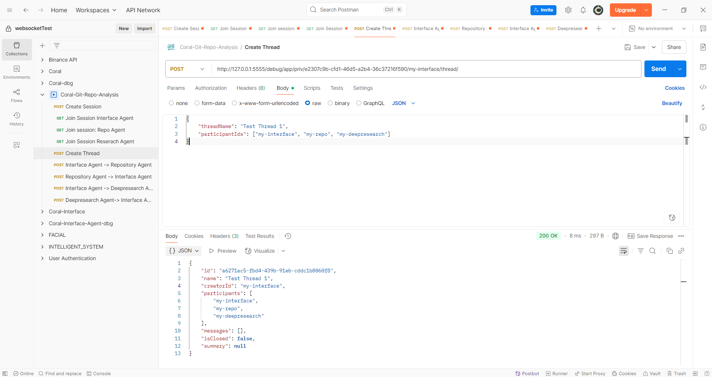

## Step 7: Start the Analysis

Once you create a thread, agents can start communicating/messaging with  other agents. Now send a message to trigger the analysis workflow.

**Method:** POST  

**URL:** `http://127.0.0.1:5555/debug/github-analyzer/secure-key-123/github-analysis-session/my-interface/thread/sendMessage/`

**Request Body:**
```json
{
  "threadId": "YOUR_THREAD_ID",
  "content": "Please analyze the GitHub repository at https://github.com/Coral-Protocol/coral-server. Start with a structural analysis of the technology stack, core functionality, and architecture. Then conduct detailed research on code quality, security considerations, and maintainability. Provide a comprehensive report.",
  "mentions": ["my-repo", "my-research"]
}
```

Replace `YOUR_THREAD_ID` with the actual thread ID from step 6.

Watch the agent connection tabs in Postman - you'll see messages flowing between agents as they collaborate on the analysis.

**Expected Output:**

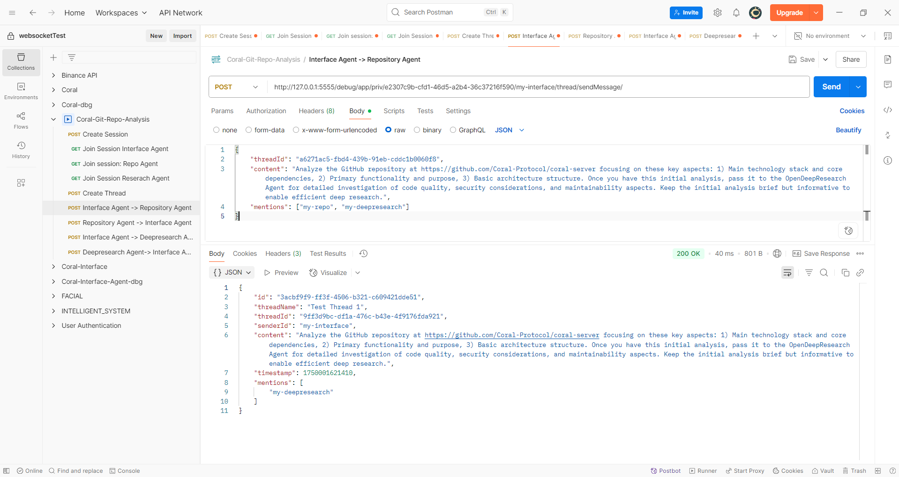

## Step 8: Set Up the Visual Debugger

Finally, we'll set up our Debugger UI to monitor and understand what's happening in our multi-agent system. Coral-dbg (Debugger UI) is a web-based debugging and monitoring tool for the Coral Protocol ecosystem that provides real-time visibility into agent interactions and system behavior.

### Key Responsibilities:
1. Real-time Monitoring: Tracks agent activities, thread communications, and message flows in the Coral Protocol system
2. Debug Interface: Provides a modern web interface for testing agent interactions, sending messages, and creating threads
3. Session Management: Handles debug sessions, agent registration, and maintains system state for debugging purposes
4. Development Support: Offers tools for testing and debugging multi-agent systems with real-time updates and event tracking

Open a new terminal in Code Editor and navigate to the debugger:

```bash
cd ../coral-dbg
```

Install dependencies:

```bash
npm install -g yarn
yarn install
```

Start the debugger:

```bash
yarn dev
```

Visit `http://localhost:5173` in your browser.

Enter these connection details:
- **Server:** `http://127.0.0.1:5555`
- **App ID:** `github-analyzer`
- **Privacy Key:** `secure-key-123`  
- **Session ID:** `github-analysis-session`

Click "Connect" and you'll see your thread listed on the left. Click on it to view the agent conversations and see how they're collaborating in real-time.

**Expected Output:**

Debugger Connection:
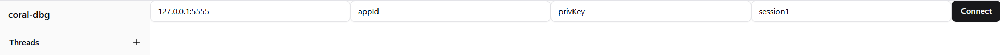

Thread View:
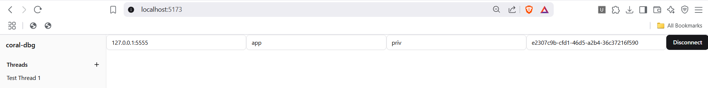

Agent Interactions:
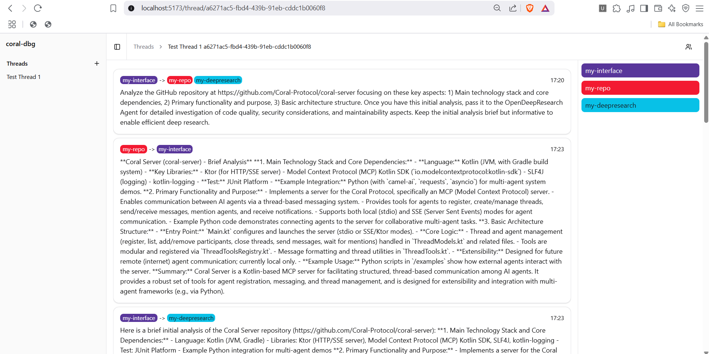

## What Happens Next

Your multi-agent system is now running. Here's the workflow:

1. The Interface Agent receives your request and coordinates the task
2. The Repository Agent clones and analyzes the GitHub repository structure
3. The Research Agent performs deep analysis using web research capabilities
4. All agents collaborate to provide comprehensive insights
5. You can monitor everything through the debugger interface

## Troubleshooting

**Server won't start:** Ensure Java 24 is installed and JAVA_HOME is set correctly.

**Agents won't connect:** Check that all API keys are valid and have proper permissions.

**No messages flowing:** Verify the thread was created successfully and agent IDs match exactly.

**Debugger won't connect:** Confirm the server is running on port 5555 and connection details are correct.

## Next Steps

With your basic system running, you can:
- Add more agents from the Coral Protocol ecosystem
- Create custom agents for specific analysis tasks
- Integrate with other APIs and services
- Build automated workflows for repository monitoring

The foundation you've built here can scale to much more complex multi-agent systems for various use cases beyond GitHub analysis.