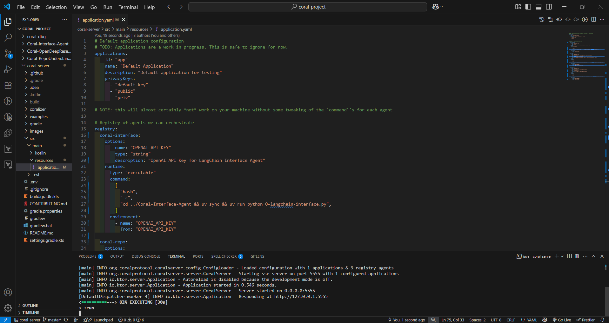
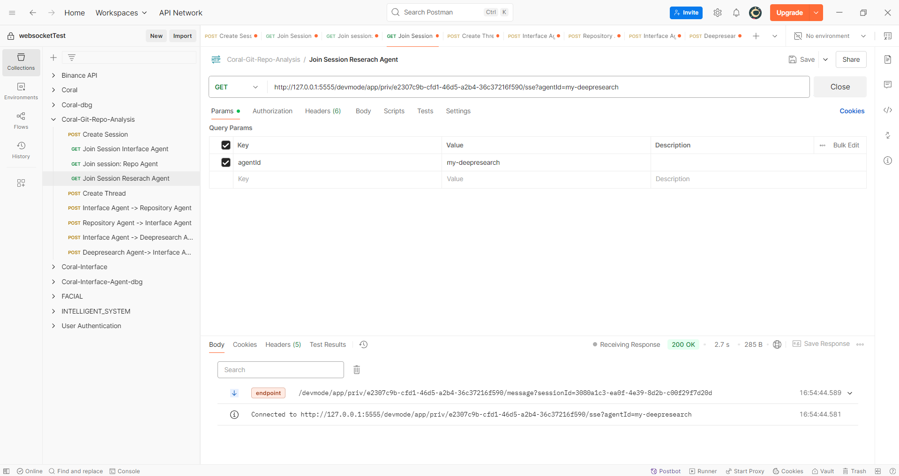

## What is Coral? 
Coral Protocol provides collaboration infrastructure for AI agents. It enables communication, coordination, trust, and payments for the Internet of Agents, laying the foundation for safe AGI.

## What will they build? 
As a developer, you've likely spent countless hours trying to make sense of unfamiliar codebases — whether for code reviews, evaluating open-source libraries, or onboarding onto a new team project. What if you could automate that entire process and get deep insights in minutes instead of hours?

In this guide, you'll build a multi-agent system that does exactly that: automatically analyzes any GitHub repository and provides a structured breakdown of its architecture, dependencies, code quality, and even external research context. Think of it as assembling a team of expert developers who instantly scan, understand, and report on a codebase — all powered by Coral Protocol.

## Prerequisites

| Tool | Version | Purpose |
|------|---------|---------|
| Node.js | 18+ | JavaScript runtime for the debugger UI |
| Python | 3.10+ | Runtime for the AI agents |
| Java JDK | 24(Preferred) | Required for the Coral backend server |
| Postman | Latest | API testing and interaction |

## Set up Coral Studio & Coral Server 

First create a workspace:

```bash
mkdir coral-project
cd coral-project
```
Now in same directory clone `coral-server` and `coral-studio`:

```bash
# Clone server and debugger
git clone https://github.com/Coral-Protocol/coral-server.git
git clone https://github.com/Coral-Protocol/coral-studio.git
```

Open the project in your code editor:

```bash
code .
```

Your folder structure should look like this:
```
coral-project/
├── coral-server/
└── coral-studio/
```

## Choosing Agents

You can select agents for your multi-agent system from the following repository:
- [Awesome Agents for Multi-Agent Systems](https://github.com/Coral-Protocol/awesome-agents-for-multi-agent-systems)

For this guide, we will use the following agents:

- **Coral-Interface-Agent**: Acts as the main interface for receiving user instructions, coordinating multi-agent tasks, and logging conversations via the terminal.
- **Coral-OpenDeepResearch-Agent**: Open-source AI assistant that automates in-depth research and report generation via multi-agent workflows, supporting web search, structured reporting, human feedback, and API/LLM integration.
- **Coral-RepoUnderstanding-Agent**: Analyze any GitHub repository by comprehensively reading key files and summarizing the repository's purpose, main modules, usage instructions, and architecture.

## Agent Configuration

### 1. Coral-Interface-Agent

#### Clone & Install Dependencies

> Make sure you are present in root directory(coral-project)

```bash
git clone https://github.com/Coral-Protocol/Coral-Interface-Agent.git
cd Coral-Interface-Agent
pip install uv
uv sync
```

#### Environment Configuration
```bash
cp .env.example .env
```

Required environment variables:
- `OPENAI_API_KEY`: Obtain from [platform.openai.com](https://platform.openai.com) → API Keys → Create new secret key

### 2. Coral-OpenDeepResearch-Agent

#### Clone & Install Dependencies

> Make sure you are present in root directory(coral-project)

```bash
git clone https://github.com/Coral-Protocol/Coral-OpenDeepResearch-Agent.git
cd Coral-OpenDeepResearch-Agent
pip install uv
uv sync
```

#### Environment Configuration
```bash
cp .env.example .env
```

Required environment variables:
- `OPENAI_API_KEY`: Obtain from [platform.openai.com](https://platform.openai.com) → API Keys → Create new secret key
- `LINKUP_API_KEY`: Obtain from [https://app.linkup.so/api-keys](https://app.linkup.so/api-keys) → API Keys

### 3. Coral-RepoUnderstanding-Agent

#### Clone & Install Dependencies

> Make sure you are present in root directory(coral-project)

```bash
git clone https://github.com/Coral-Protocol/Coral-RepoUnderstanding-Agent.git
cd Coral-RepoUnderstanding-Agent
pip install uv
uv sync
```

#### Environment Configuration
```bash
cp .env.example .env
```

Required environment variables:
- `OPENAI_API_KEY`: Obtain from [platform.openai.com](https://platform.openai.com) → API Keys → Create new secret key
- `GITHUB_ACCESS_TOKEN`: Generate from [GitHub](https://github.com) → Settings → Developer settings → Personal access tokens

Your folder structure should look like this:
```
coral-project/
├── Coral-Interface-Agent/
├── Coral-OpenDeepResearch-Agent/
├── Coral-RepoUnderstanding-Agent/
├── coral-server/
└── coral-studio/
```

## Additional Resources
- [Software Testing Guide](https://docs.coralprotocol.org/CoralDoc/Guide/awesome-softwaretesting)
- [Creating Custom Agents Tutorial](https://docs.coralprotocol.org/CoralDoc/Guide/awesome-softwaretesting)

## Set up agent definitions config:

Now that we have all our components, we need to set up the communication infrastructure. The Coral server acts as the communication hub for your agents. You need to configure it to recognize and run your agents.

Navigate to the `coral-server` directory:

```bash
cd .\coral-server\
```
**Understanding the Agent Registry**
Before we dive into the configuration, let's understand what we're setting up. The `application.yaml` file contains an "Agent Registry" - think of it as a directory that tells the Coral server:

- Which AI agents you can use in your sessions
- The commands needed to run each agent program
- Each agent's API keys, configuration options, and environment settings
- Communication setup between agents and the server

Each agent in the registry has two main parts:

- Options: The configuration settings users need to provide (like API keys)
- Runtime: Instructions for how to actually start and run the agent

Open `src/main/resources/application.yaml` and replace its contents with this configuration:


```yaml
registry:
  coral-interface:
    options:
      - name: "OPENAI_API_KEY"
        type: "string"
        description: "OpenAI API Key for Interface Agent"
    runtime:
      type: "executable"
      command:
        [
          "bash",
          "-c",
          "cd ../Coral-Interface-Agent && uv sync && uv run python 0-langchain-interface.py",
        ]
      environment:
        - name: "OPENAI_API_KEY"
          from: "OPENAI_API_KEY"

  coral-repo:
    options:
      - name: "OPENAI_API_KEY"
        type: "string"
        description: "OpenAI API Key for RepoUnderstanding Agent"
      - name: "GITHUB_PERSONAL_ACCESS_TOKEN"
        type: "string"
        description: "GitHub Personal Access Token"
    runtime:
      type: "executable"
      command:
        [
          "bash",
          "-c",
          "cd ../Coral-RepoUnderstanding-Agent && uv sync && uv run 4-langchain-RepoUnderstandingAgent.py",
        ]
      environment:
        - name: "OPENAI_API_KEY"
          from: "OPENAI_API_KEY"
        - name: "GITHUB_PERSONAL_ACCESS_TOKEN"
          from: "GITHUB_PERSONAL_ACCESS_TOKEN"

  coral-research:
    options:
      - name: "OPENAI_API_KEY"
        type: "string"
        description: "OpenAI API Key for OpenDeepResearch agent"
      - name: "LINKUP_API_KEY"
        type: "string"
        description: "LinkUp API Key for OpenDeepResearch agent"
    runtime:
      type: "executable"
      command:
        [
          "bash",
          "-c",
          "cd ../Coral-OpenDeepResearch-Agent && uv sync && uv run python langchain_open_deep_research.py",
        ]
      environment:
        - name: "OPENAI_API_KEY"
          from: "OPENAI_API_KEY"
        - name: "LINKUP_API_KEY"
          from: "LINKUP_API_KEY"
```
Now start the server:

```bash
./gradlew run
```

**Expected Output:**


> Keep this terminal open - the server needs to stay running. You should see output indicating the server has started successfully on port 5555.

## Create a Session

Now that the server is running, you can interact with it via API. Use Postman (or any HTTP client) to send a request to create a new session. 

When you create a session, you're essentially telling Coral Protocol:
- Which agents you want to use
- How those agents should be configured (with their API keys)
- Which agents are allowed to talk to each other

Let's break down what each part of the session configuration means:
Understanding the Session Structure
- Application ID & Privacy Key: These act like room credentials - they identify your workspace and keep it secure. In development mode, you can use any values you want.
- Agent Graph: This is where you define your team of agents:

- agents: A list of all the agents you want in your session, each with a unique name you choose
links: Rules about which agents can communicate with each other

- Agent Configuration: For each agent, you specify:

    - type: "local" (agents running on your machine)
    - agentType: The specific agent from your registry (like "coral-interface")
    - options: The API keys and settings that agent needs

- Communication Links: The `links` array defines who can talk to whom. Each inner array represents a group of agents that can all communicate with each other.

**Let's create session:**

Open Postman and create a new request:

**Method:** POST  

**URL:** `http://localhost:5555/sessions`

**Request Body (JSON):**
```json
{
  "sessionId": "github-analysis-session",
  "applicationId": "github-analyzer",
  "privacyKey": "secure-key-123",
  "agentGraph": {
    "agents": {
      "my-interface": {
        "type": "local",
        "agentType": "coral-interface",
        "options": {
          "OPENAI_API_KEY": "YOUR_OPENAI_API_KEY"
        }
      },
      "my-repo": {
        "type": "local",
        "agentType": "coral-repo",
        "options": {
          "OPENAI_API_KEY": "YOUR_OPENAI_API_KEY",
          "GITHUB_PERSONAL_ACCESS_TOKEN": "YOUR_GITHUB_TOKEN"
        }
      },
      "my-research": {
        "type": "local",
        "agentType": "coral-research",
        "options": {
          "OPENAI_API_KEY": "YOUR_OPENAI_API_KEY",
          "LINKUP_API_KEY": "YOUR_LINKUP_API_KEY"
        }
      }
    },
    "links": [["my-interface", "my-repo", "my-research"]]
  }
}
```

**Important:** Replace all `YOUR_*_API_KEY` placeholders with your actual API keys.

Send the request. The response will contain your session details. Save these values - you'll need them:
- `sessionId`
- `applicationId` 
- `privacyKey`

**Expected Output:**


## Connect Your Agents

Once your session is created, it's time to connect each agent so they can start listening for messages. Each agent opens a **Server-Sent Events (SSE)** connection to the Coral Server. This lets you see live messages and interactions.

Create three new GET requests in Postman (open each in a separate tab):

**Agent 1 - Interface Agent:**
```
GET http://127.0.0.1:5555/devmode/github-analyzer/secure-key-123/github-analysis-session/sse?agentId=my-interface
```

**Agent 2 - RepoUnderstanding Agent:**
```
GET http://127.0.0.1:5555/devmode/github-analyzer/secure-key-123/github-analysis-session/sse?agentId=my-repo
```

**Agent 3 - OpenDeepResearch Agent:**
```
GET http://127.0.0.1:5555/devmode/github-analyzer/secure-key-123/github-analysis-session/sse?agentId=my-research
```

Send all three requests. Each should show "Connected" status and start streaming events. Keep these tabs open to monitor agent activity.

**Expected Output:**

<div style="display: flex; flex-wrap: wrap; justify-content: center; gap: 20px;">
  <div style="flex: 0 0 48%; box-sizing: border-box;">
    <h3>Interface Agent Connection:</h3>
    
  </div>
  <div style="flex: 0 0 48%; box-sizing: border-box;">
    <h3>RepoUnderstanding Agent Connection:</h3>
    
  </div>
  <div style="flex: 0 0 48%; box-sizing: border-box;">
    <h3>OpenDeepResearch Agent Connection:</h3>
    
  </div>
</div>

## Get Output

Finally, we'll set up our Debugger UI to monitor and understand what's happening in our multi-agent system. Coral-studio (Debugger UI) is a web-based debugging and monitoring tool for the Coral Protocol ecosystem that provides real-time visibility into agent interactions and system behavior.

### Key Responsibilities:
1. Real-time Monitoring: Tracks agent activities, thread communications, and message flows in the Coral Protocol system
2. Debug Interface: Provides a modern web interface for testing agent interactions, sending messages, and creating threads
3. Session Management: Handles debug sessions, agent registration, and maintains system state for debugging purposes
4. Development Support: Offers tools for testing and debugging multi-agent systems with real-time updates and event tracking

Open a new terminal in Code Editor and navigate to the debugger:

```bash
cd ../coral-studio
```

Install dependencies:

```bash
npm install -g yarn
yarn install
```

Start the debugger:

```bash
yarn dev
```

Visit `http://localhost:5173` in your browser.

Enter these connection details:
- **Server:** `http://127.0.0.1:5555`
- **App ID:** `github-analyzer`
- **Privacy Key:** `secure-key-123`  
- **Session ID:** `github-analysis-session`

Click "Connect" and you'll see your thread listed on the left. Click on it to view the agent conversations and see how they're collaborating in real-time.

**Expected Output:**

Debugger Connection:


Thread View:


Agent Interactions:


## What Happens Next

Your multi-agent system is now running. Here's the workflow:

1. The Interface Agent receives your request and coordinates the task
2. The RepoUnderstanding Agent clones and analyzes the GitHub repository structure
3. The OpenDeep performs deep analysis using web research capabilities
4. All agents collaborate to provide comprehensive insights
5. You can monitor everything through the debugger interface
